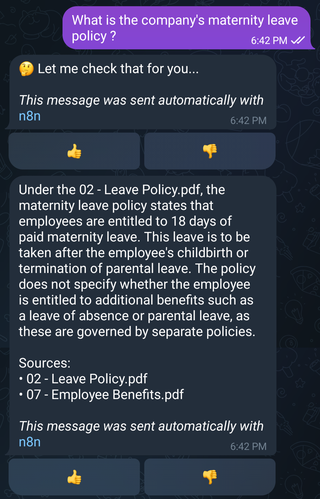
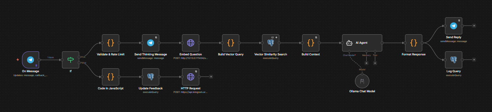
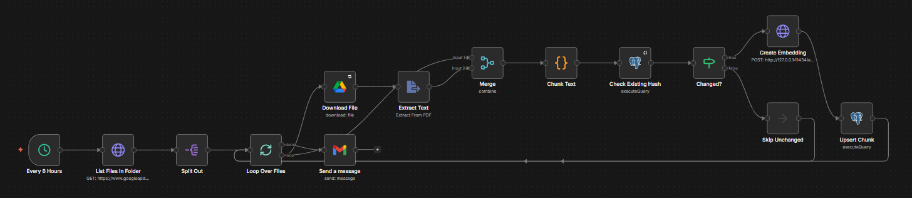
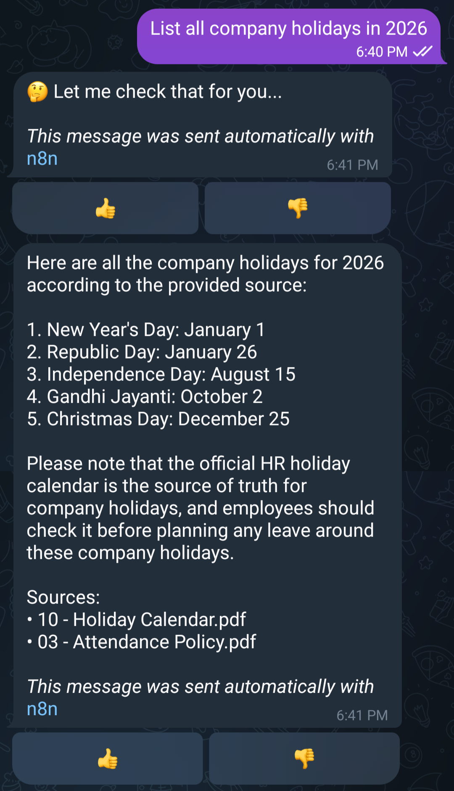
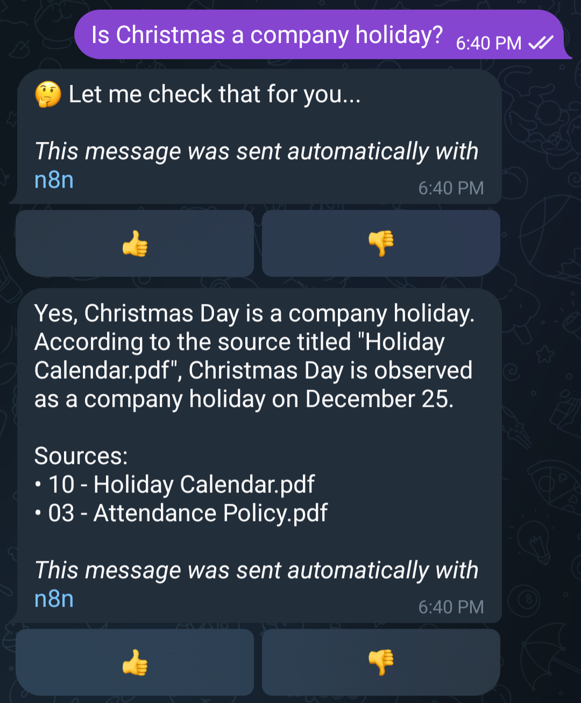
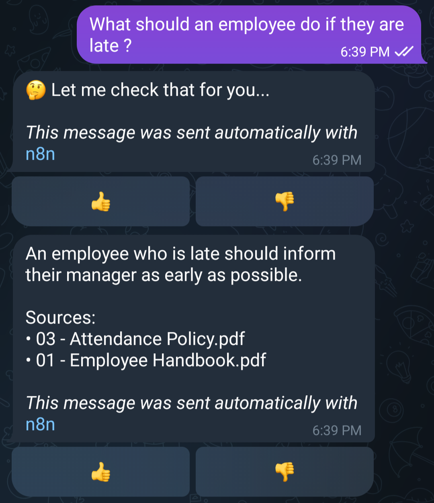
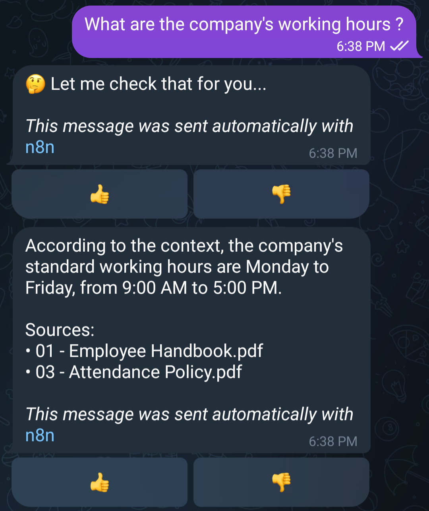
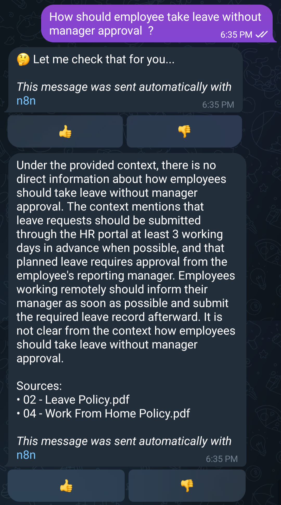
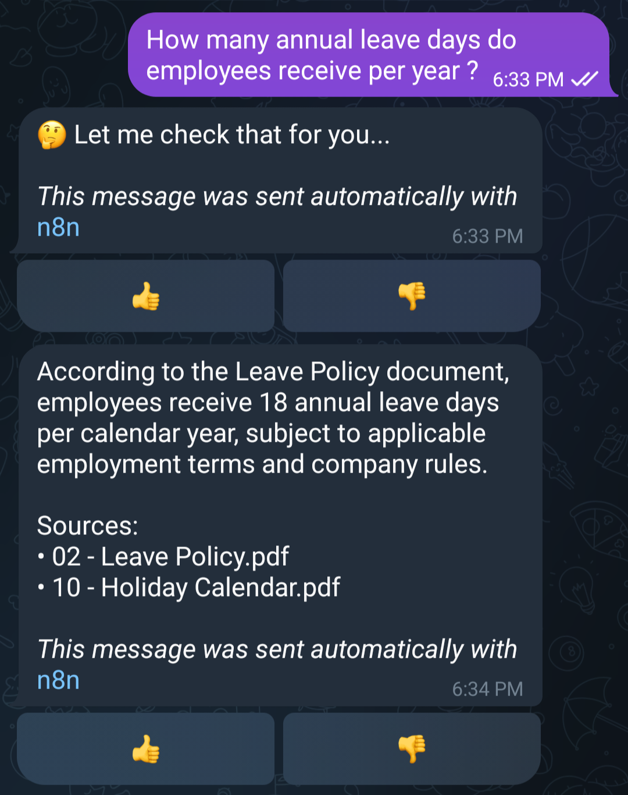
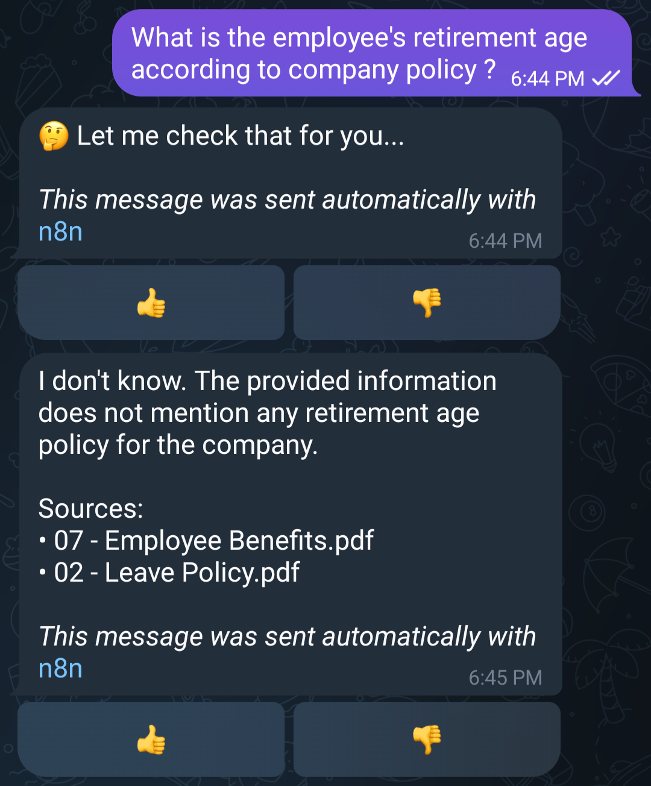

# Internal Knowledge Base — RAG Assistant (Telegram Bot)

A fully local Retrieval-Augmented Generation (RAG) system that answers employee questions about company policy documents, built with **n8n**, **Ollama** (local LLMs, no API costs), **Supabase/pgvector**, and **Telegram**.

Ask it a question like *"How many annual leave days do I get?"* and it retrieves the actual relevant policy chunk from a Google Drive folder of PDFs, generates a grounded answer with a local LLM, and replies with cited sources — all running on local infrastructure with zero per-query API cost.



## Why this exists

Most "RAG demo" projects call OpenAI/Gemini for both embeddings and generation. This one deliberately runs **entirely on local models** (Ollama) against a **self-hosted automation platform** (n8n) and a **real Postgres vector store** (Supabase + pgvector) — closer to what a cost-conscious internal tool would actually look like, and a genuine test of debugging distributed systems rather than just calling an API.

## Architecture

Two independent n8n workflows, sharing one Postgres database:

**1. Ingestion** (scheduled every 6 hours)
```
Google Drive folder → List files → Download → Extract text (PDF)
  → Merge with file metadata → Chunk text → Check if content changed
  → [changed] → Embed (Ollama: nomic-embed-text) → Upsert to Postgres/pgvector
  → [unchanged] → Skip (cost control)
```

**2. Query & Answer** (Telegram-triggered)
```
Telegram message → Validate/rate-limit → Embed question (Ollama)
  → Vector similarity search (pgvector cosine distance) → Build context
  → Generate answer (Ollama: qwen2.5:1.5b, via LangChain AI Agent) → Format with citations
  → Reply on Telegram (with 👍/👎 feedback buttons)
```

A separate branch handles feedback button presses: parses the callback, updates the logged query's feedback in Postgres, and acknowledges the Telegram callback.




## Tech stack

| Layer | Choice |
|---|---|
| Orchestration | [n8n](https://n8n.io) (self-hosted) |
| Embeddings | Ollama — `nomic-embed-text` (768-dim) |
| Generation | Ollama — `qwen2.5:1.5b` (via n8n's LangChain AI Agent node) |
| Vector store | Supabase Postgres + [pgvector](https://github.com/pgvector/pgvector) |
| Document source | Google Drive (PDF policy documents) |
| Interface | Telegram Bot API |
| Local tunneling | ngrok (for Telegram webhook during local dev) |

## What this demonstrates

- Change-detection ingestion (content-hash based) to avoid re-embedding unchanged documents — with a secondary guard (`has_embedding`) for the edge case where an embedding is missing despite an unchanged hash
- Working around a real Supabase/pgvector parameter-binding quirk by building literal SQL instead of relying on driver-level parameterization (see [`workflows/query/build-vector-query.js`](./workflows/query/build-vector-query.js))
- Defensive handling of empty/malformed retrieval results so the bot never surfaces raw `undefined` to a user
- A feedback loop wired directly into Telegram's inline-keyboard callback system, logged back to Postgres
- Running the full pipeline on consumer hardware (8GB RAM, CPU-only) — including the real tradeoffs that come with it (see Limitations below)

## Setup

### 1. Database schema
Run [`schema/schema.sql`](./schema/schema.sql) against a Postgres database with the `vector` extension available (Supabase provides this by default).

### 2. Ollama models
```bash
ollama pull nomic-embed-text
ollama pull qwen2.5:1.5b
```

### 3. n8n credentials needed
- Google Drive OAuth2 (read access to your policy documents folder)
- Postgres (pointed at your Supabase **direct connection**, not the pooler — see note in `schema.sql`)
- Telegram Bot API (create a bot via [@BotFather](https://t.me/BotFather))
- Ollama runs locally with no credential — HTTP nodes point at `http://127.0.0.1:11434` (use `127.0.0.1`, not `localhost`, to avoid an IPv6 resolution issue on Windows)

### 4. Local webhook tunnel
Telegram requires an HTTPS webhook. For local development:
```bash
ngrok http 5678
```
Set n8n's `WEBHOOK_URL` environment variable to the ngrok HTTPS URL before starting n8n.

### 5. Build the workflows
The `workflows/` folder contains the actual logic (Code node scripts and SQL) used in each n8n node — see the inline comments in each file for which node it belongs to and how it connects to the next step. This is provided as reference code rather than a raw n8n export, so nothing here contains credentials, hosts, or environment-specific config.

## Known limitations / honest tradeoffs

- **Small local models trade some accuracy for cost/privacy.** `qwen2.5:1.5b` runs well on 8GB RAM but occasionally under-performs a larger model on nuanced questions. A larger model (or a cloud API) would improve quality at the cost of running locally.
- **Response latency is ~30-40 seconds** on CPU-only 8GB hardware — acceptable for a demo/internal tool, not for a production-scale support bot.
- **Corpus size (10 documents) uses a small `LIMIT`** on vector search (top 1-2 results) — tuned for this scale; a larger knowledge base would need reranking or a larger `LIMIT` with post-filtering.
- **Feedback loop logs to Postgres** but there's no dashboard yet to review low-rated answers — a natural next step.

## Roadmap

- [ ] Reranking step before context is built, for larger corpora
- [ ] Swap the fixed-size chunking for a semantic/section-aware chunker
- [ ] Feedback review dashboard
- [ ] Multi-source ingestion (Notion, Confluence) alongside Google Drive

## Demo Questions








